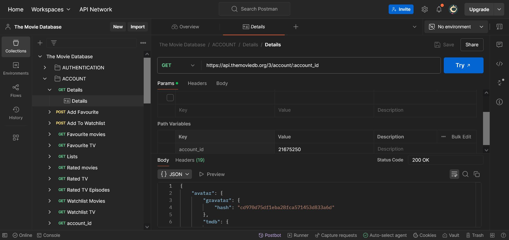
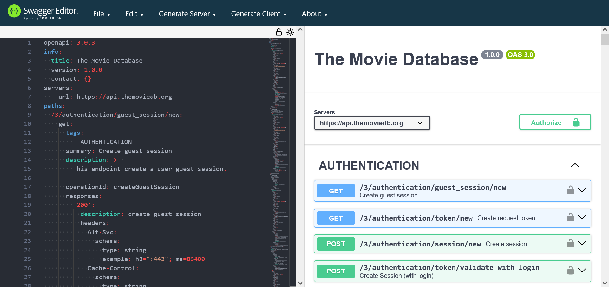
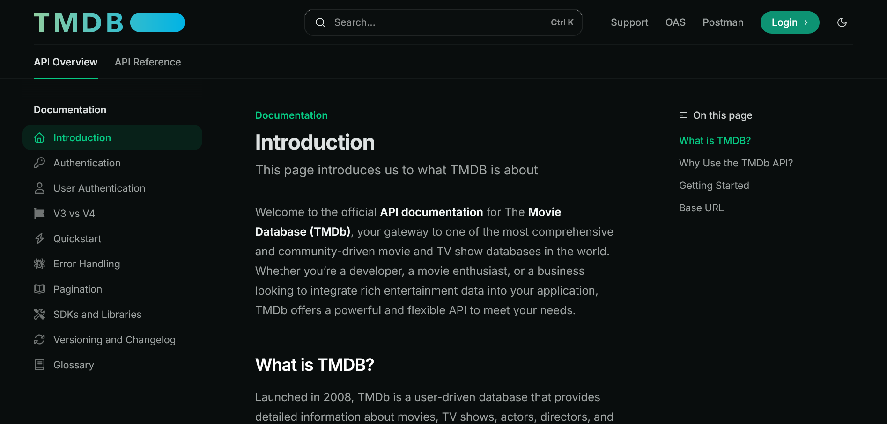

# Movie Database (TMDb)

Welcome to the TMDB Movie Database API! This API provides developers with access to a vast repository of movie and TV show data, enabling seamless integration of entertainment information into your applications.

## Introduction

The TMDB Movie Database API offers a comprehensive and community-driven collection of movie and TV show data. Whether you're building a movie review site, a streaming guide, or any entertainment-related application, our API provides the necessary tools to access detailed information about movies, TV shows, actors, and more.

## Features

* **Comprehensive Movie Data**: Access detailed information about movies, including titles, release dates, genres, ratings, and more.

* **TV Show Details**: Get data about TV shows, including episodes, seasons, and cast.

* **Actor Information**: Fetch details about actors, including their filmography and biography.

* **Search Functionality**: Search for movies, TV shows, and actors by name or keyword.

* **Pagination**: Handle large datasets efficiently with built-in pagination.

* **Rate Limiting**: Ensures fair usage and prevents abuse of the API.

* **Well-Documented**: Clear and detailed API documentation for easy integration.
  
## API Documentation

For detailed information about the API, including all available endpoints, request/response examples, and usage guidelines, visit the official documentation:

📚 [API Documentation](https://sirjosh.mintlify.app/introduction)

Note: The docs was built with Postman, OpenAPI spec File and Mintlify and it contain more than 150+ endpoints.

1. [Postman](https://documenter.getpostman.com/view/32759704/2sAYdeLrFR) was used to all the endpoint to ensure funtionality.



2. Documented the parameters (path, query and body) and responses using [OpenAPI spec file](https://raw.githubusercontent.com/onwuemenejoshua/docs/refs/heads/main/api-reference/openapi3.json)



3. Built the conceptual pages on [Mintlify](https://sirjosh.mintlify.app/introduction) to help developers understand our API



To use the TMDB Movie Database API, you don't need to install anything. Simply make HTTP requests to the appropriate endpoints. However, if you want to run the API locally. Just ```clone``` the repository

```
git clone https://github.com/onwuemenejoshua/docs.git
```

Thanks🚀
