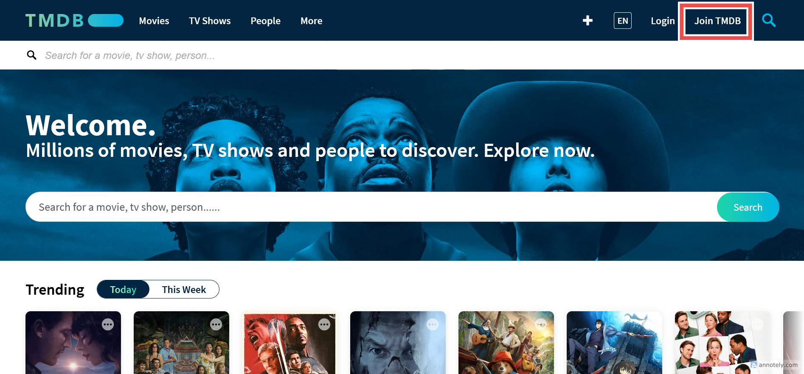
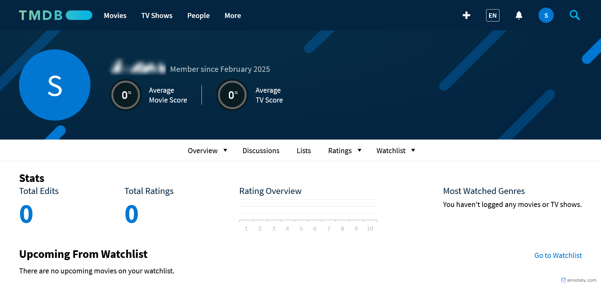
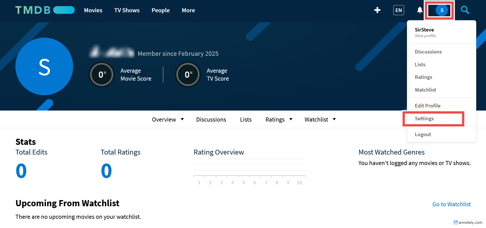
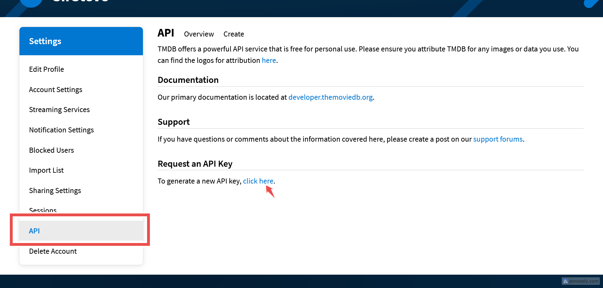
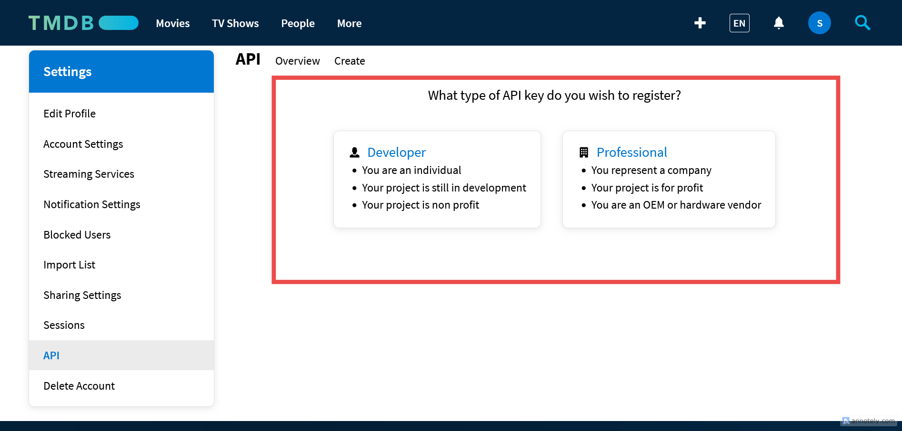
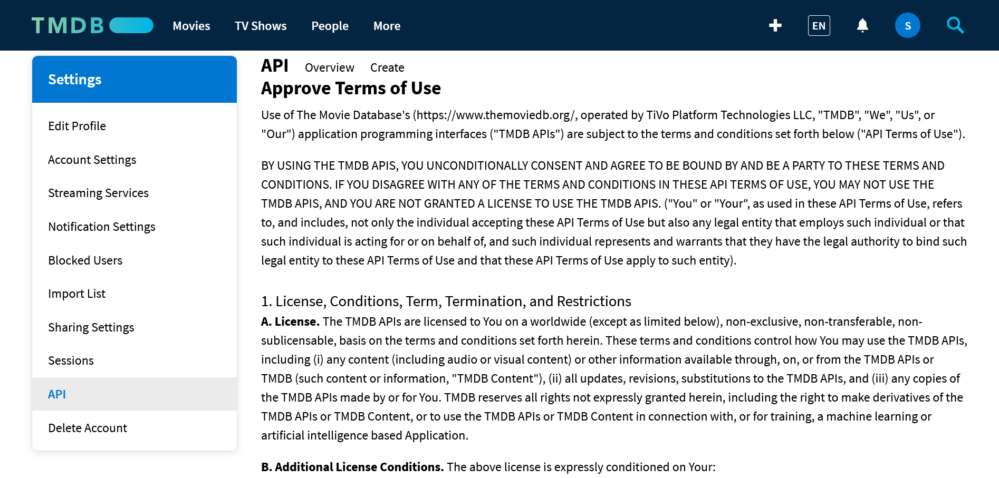
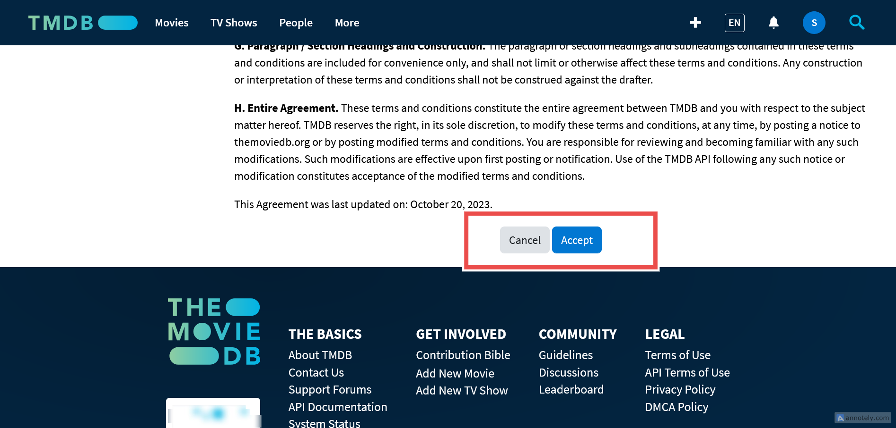
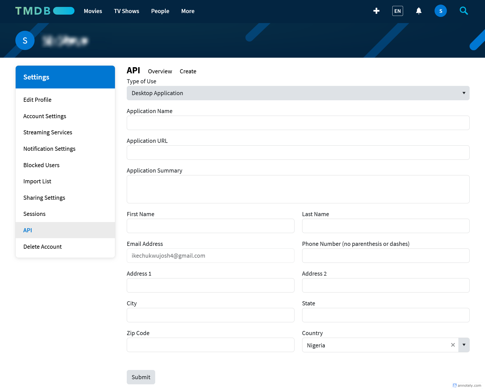
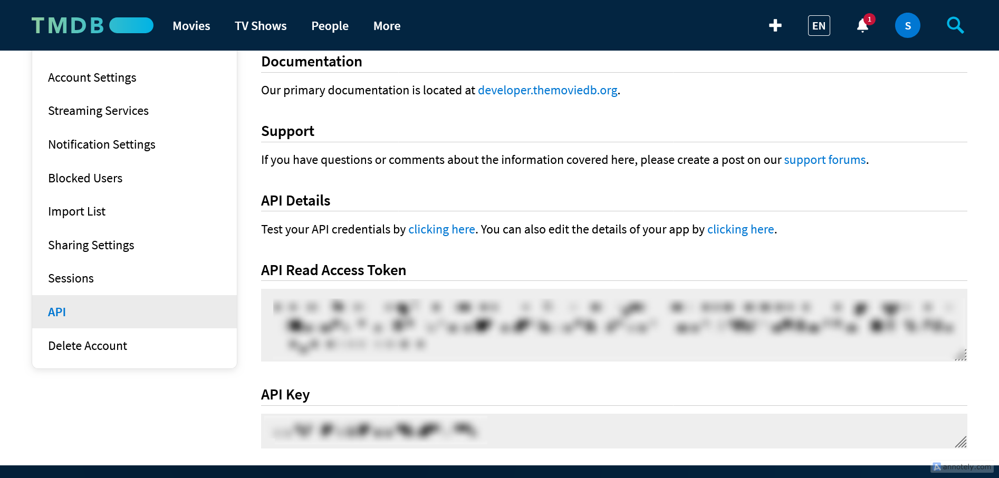

Our **TMDb API** uses the Bearer Token to interact with our API. Here's how get the bearer token.

<Note>
  The API key is not functional at the moment, hence you are to work with the
  Read accces token (Bearer token)
</Note>

1. Create a TMDb account

Before you can obtain your bearer token, you need to have a TMDb account. If you don’t already have one, follow these steps:

- Go to [TMDb](https://www.themoviedb.org/)
- Click on Sign Up in the top-right corner.

- Fill in the required details (username, email, and password) and complete the registration process.

- Verify your email address by clicking the link sent to your inbox.

2. Request your bearer token

Once you have a TMDb account, you can request your bearer token:

- In your profile, click on settings

- scroll to the API tab and click on **"click here"**

- Select the type of API key you wish to register

- Read and agree to the TMDb API terms of use.

- Fill the necessary details and submit the form and you will see your API key and your read access token also known as bearer token.

<Note>
  In our [quickstart](/quickstart) page we will be making an API request using
  our bearer token to one of the endpoint
</Note>
