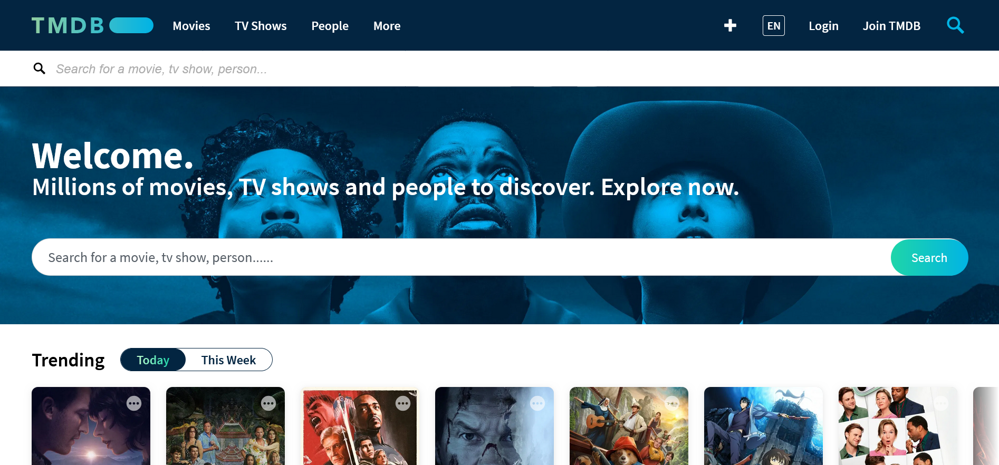

Welcome to the official **API documentation** for The **Movie Database (TMDb)**, your gateway to one of the most comprehensive and community-driven movie and TV show databases in the world. Whether you're a developer, a movie enthusiast, or a business looking to integrate rich entertainment data into your application, TMDb offers a powerful and flexible API to meet your needs.

## What is TMDB?

Launched in 2008, TMDb is a user-driven database that provides detailed information about movies, TV shows, actors, directors, and crew members from around the globe. It offers a wide range of features, including:

- Movie and TV Show Details: Access detailed metadata about movies and TV shows, including titles, synopses, cast, crew, release dates, genres, trailers, and ratings.
- Discover and Search: Easily discover movies and TV shows by genres, release dates, or popularity, and search for specific titles or people.
- Community Contributions: TMDb is powered by a passionate community of contributors who help keep the database accurate and up to date.
- Multi-language Support: The platform supports multiple languages, ensuring a global user experience.



## Why Use the TMDb API?

The TMDb API allows developers to seamlessly integrate movie and TV show data into their own applications. Whether you are building a movie review site, a streaming guide, or a personalized entertainment dashboard, the TMDb API provides the tools you need to:

- Access comprehensive movie and TV show metadata.
- Retrieve high-quality posters, backdrops, and promotional images.
- Get real-time updates on upcoming releases and trending content.
- Integrate user ratings and reviews for better audience insights.

This documentation contains request examples, responses, and other conceptual pages to help you understand who we are. The example requests are available in multiple languages, allowing you to work with any and have your desired outcomes.

## Getting Started

Before you dive in, you’ll need to sign up for a bearer token. This will grants you access to the API’s endpoints, enabling you to explore all our endpoint.

Check out our [Authentication](/Authentication) section for more details on how to obtain and use your bearer token. Also, check out the [Errors](/Error-code) page to familiarize yourself with potential errors you may encounter while exploring our API. Additionally, visit the [Quickstart](/quickstart) page to learn how to make an API request.

## Base URL

```bash
https://api.themoviedb.org/3/
```

Don't be shy—dive in❤️
